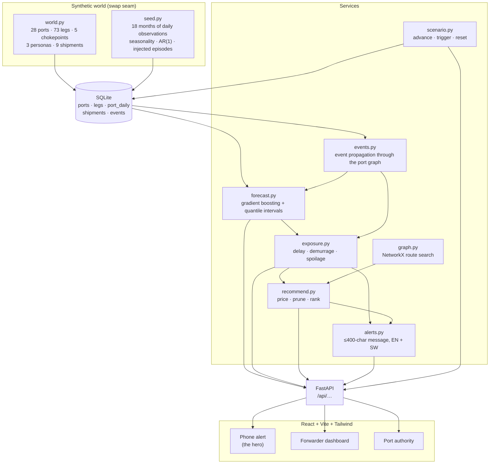

# PortPulse

**Supply-chain disruption early warning and adaptive rerouting for small exporters.**

Enterprise shippers buy six-figure disruption-intelligence platforms. A mango
exporter in Mombasa shipping two containers a month operates blind. PortPulse
closes that gap with three functions and one delivery channel that works on a
2G phone:

| | |
|---|---|
| **Predict** | Corridor and port-level disruption forecasts 1–21 days ahead, each with a prediction interval, a disruption probability and a confidence score. |
| **Personalise** | Those forecasts walked against *your* booking: expected delay days, demurrage in dollars, spoilage risk against your cargo's shelf life. |
| **Prescribe** | Ranked alternatives — reroute, change discharge port, delay departure — each priced on cost, time, risk and emissions, with "hold current plan" always shown and quantified. |

The hero interaction is a **WhatsApp-length alert**, not a dashboard.

> **Demo running on synthetic data modeled on the Southeast Asia–Gulf corridor.**
> Everything runs offline on one laptop. No cloud services, no external APIs, no
> LLM calls.

---

## Quick start

```bash
make setup      # once: create .venv, install Python + npm dependencies
make dev        # seeds the database, trains the model, starts both servers
```

* Demo → <http://localhost:5173>
* API docs → <http://localhost:8000/docs>

The first `make dev` trains the forecaster (about 30 seconds) and caches it to
`backend/data/models/`. Every run after that starts immediately.

Or with containers — the image seeds and trains at **build** time, so the
running stack never needs a network:

```bash
docker compose up --build     # demo on http://localhost:8080
```

Other useful targets:

```bash
make test         # 103 pytest cases + frontend smoke tests
make demo-check   # replay the scripted demo against the running API
make reseed       # rebuild the world and retrain from scratch
make clean        # delete generated data, model and build output
```

---

## Architecture



```
portpulse/
├── backend/
│   ├── app/
│   │   ├── world.py        static world: ports, legs, chokepoints, personas, shipments
│   │   ├── seed.py         deterministic 18-month observation generator
│   │   ├── models.py       SQLAlchemy schema
│   │   ├── schemas.py      Pydantic v2 API contract
│   │   ├── services/       forecast · events · exposure · graph · recommend · alerts · scenario
│   │   └── routers/        reference · forecasts · shipments · demo
│   └── tests/              103 pytest cases
├── frontend/src/
│   ├── views/              PhoneView · DashboardView · PortView
│   ├── components/         CorridorMap (offline SVG) · LeafletMap (lazy) · charts · primitives
│   └── api/                typed client mirroring schemas.py
└── scripts/demo_check.py   replays the scripted demo against a live API
```

---

## How the models actually work

### Forecasting — `services/forecast.py`

Gradient-boosted regressors (`HistGradientBoostingRegressor`) predict **congestion
index** and **vessel waiting days** for every port, 1–21 days ahead.

* **One global model per target, horizon as a feature.** 28 ports × 18 months is
  not enough data for 28 separate models, and a global model lets a quiet port
  borrow shock-shape information from a busy one. Horizon is an input rather
  than 21 separate models, which keeps intervals monotone in horizon.
* **Direct multi-horizon**, not recursive — no compounding error.
* **Quantile models at the 10th and 90th percentiles** give the band. It is a
  fitted interval, not a fabricated ± number.
* Features: congestion lags (0–27 days), rolling means and volatility, waiting
  and weather lags, recent arrivals, week-on-week trend, calendar and port
  attributes.

Held out on the final 21 target-days of the training window:

| Target | PortPulse MAE | Naive persistence MAE |
|---|---|---|
| Congestion index (0–100) | **3.77** | 5.46 |
| Waiting days | **0.27** | 0.37 |

`GET /api/model` reports these live. A forecast that cannot beat "tomorrow looks
like today" is not worth shipping, so the test suite asserts it.

**Disruption probability** is `P(congestion > this port's threshold)`, from a
normal fitted to the quantile band. **Confidence** blends interval sharpness
(55%), horizon (30%) and data recency (15%) into 0–1, and is always displayed
next to the number it qualifies.

### Event propagation — `services/events.py`

The statistical model learns how a port behaves. It cannot predict a security
incident that has not happened yet, and pretending otherwise would be the
dishonest part of a demo like this. Declared events are therefore **exogenous**:

```
forecast = ML baseline  +  Σ (impact of each active event)
```

Both terms are returned separately (`congestion_baseline`, `event_uplift`,
`event_drivers`) and shown separately in the UI.

Propagation rules:

* A **port event** hits that port, and spills over at 25% to its direct
  neighbours.
* A **chokepoint event** hits every port in proportion to how much of its sea
  service transits that chokepoint, weighting arrivals fully and departures at
  40% — a port congests because ships pile up waiting to berth. This is why
  Salalah is the corridor's shock absorber: nothing *arrives* there via Bab
  el-Mandeb, so a Red Sea event leaves its yard alone even though it relays
  cargo onward through the strait.
* Impact follows ramp → plateau → decay in days since declaration, and widens
  the prediction band as well as raising the level.

### Exposure — `services/exposure.py`

Walks a plan (route + departure date + cargo) leg by leg:

* Each **port call** contributes `service_factor × max(0, forecast waiting −
  that port's normal waiting)`. The service factor encodes berth priority: a
  feeder queues behind mainline vessels (1.35), a mainline call does not (0.85),
  a road delivery never enters the berth queue at all (0.0).
* Each **chokepoint transit** contributes `risk × delay-at-max-risk` days.
* Each **transshipment** carries a connection risk: schedules hold about a day
  and a half of slack, and past that the later you arrive the likelier you miss
  the onward sailing and wait a full service interval.

Contributions are summed as independent normals, giving delay quantiles,
`P(>3 days)`, `P(>7 days)`, expected demurrage (`E[max(0, delay − free days)] ×
rate × TEU`) and, for perishables, `P(transit + delay > shelf life)`.

**Headline risk is the probability of missing the buyer's deadline**, not a
fixed number of days. Three days late means something very different on a 6-day
Mombasa–Jeddah run and a 22-day Shanghai–Jeddah run, and a badge that ignores
that just tells a forwarder their long routes are permanently red.

### Recommendations — `services/recommend.py`

The differentiator, and the most heavily tested module.

1. **Generate**: k fastest routes through the NetworkX port graph (alternative
   transshipment hubs, alternative discharge ports plus a road leg, the Cape
   swing where one exists), crossed with departure options (+0/+3/+5/+7 days;
   perishables cap at +3 because the fruit is already picked).
2. **Price** every candidate as **expected total landed cost**:
   `freight + demurrage + expected spoilage loss + late-delivery penalty +
   inventory holding + carbon`.
3. **Prune** any alternative dominated on all four headline criteria (Δcost,
   Δarrival, Δrisk-days, ΔCO₂) by another shown option.
4. **Rank** by total landed cost and generate a one-sentence rationale.

Money is the only unit in which a mango exporter's spoilage risk and a
forwarder's demurrage bill can be compared, and it makes the engine cargo-aware
without hand-tuned persona weights: for a threatened perishable the spoilage
term dominates by itself and the engine will happily recommend the *more
expensive* freight option.

Every economic assumption is one constant at the top of the file and is echoed
back through `GET /api/shipments/{id}/recommendations` under `assumptions`:
carbon at $95/t, holding cost 0.045%/day of cargo value, late-delivery penalty
2%/day for perishables and 0.8%/day for dry cargo.

---

## Honesty affordances

The point of a tool like this is that a trader believes it. Concretely:

* Every forecast displays a **numeric confidence**, never a bare colour.
* **"How was this predicted?"** opens a plain-language breakdown by group
  ablation: each semantic group of features is replaced by its training median
  and the prediction re-run, so the numbers are the model's real sensitivity in
  congestion-index points. Declared events are listed first and labelled as
  events, not folded into a lag.
* The **statistical baseline and the event uplift are always reported
  separately**, so nobody can mistake "we modelled the news" for "we predicted
  the news".
* An active disruption **widens the band and lowers confidence** — the demo gets
  less certain exactly when it gets more dramatic.
* **Thumbs up/down** on every alert is stored (`POST /api/feedback`) to show the
  trust feedback loop.
* Content being refetched is visibly dimmed, so a stale number is never
  presented as a live one.
* The disclaimer sits in the footer of every view.

---

## The scripted demo (§7) — presenter checklist

Run `make demo-check` first; it replays all of this against the live API and
prints each beat. Total runtime on stage: under three minutes.

- [ ] **Open on Amina.** Phone alert view, simulated date Wed 6 Aug 2025. Her
      mango booking (Mombasa → Jeddah, 2 TEU, 14-day shelf life, ETD 12 Aug) is
      green, and so are all nine shipments. The phone shows an all-clear.
- [ ] **Click "Trigger scenario".** A Red Sea security event and a Jeddah
      congestion event are declared. Observed history is *not* rewritten.
- [ ] **Click "Advance day".** Simulated date moves to 7 Aug.
- [ ] **Amina flips red** — 96% spoilage risk, ~8 days expected delay. Bab
      el-Mandeb shows 93% transit risk on the map.
- [ ] **Read the alert** (263 characters, one SMS). Tap **Kiswahili** to show the
      same alert localised.
- [ ] **Tap "Reply 1"** to reveal the ranked options as chat bubbles with
      cost / time / risk / CO₂ chips. Top option: *Depart 15 Aug (+3 days) via
      Salalah, discharge at King Abdullah Port, road to Jeddah.*
- [ ] **Switch to Rafael.** Three of eight bookings are flagged; the riskiest
      sorts to the top. Open one to show the delay distribution, the per-call
      breakdown and the alternatives table with a dominated "hold" labelled.
- [ ] **Switch to Port of Jeddah.** Congestion crosses the threshold on 14 of
      14 days and peaks near 95; the declared events are itemised beneath the
      chart with the baseline shown separately. Open **"How was this
      predicted?"**.
- [ ] **Back to Amina. Tap "Choose this".** The route redraws via Salalah and
      King Abdullah Port, risk falls from 96% to ~21%, and a confirmation
      message arrives. Give it a 👍.
- [ ] **Click "Reset"** to restore the seed state for the next run.

### Two honest deviations from the brief's §7 wording

The recommendation engine is never overridden to produce a scripted answer, so
two details differ from the illustrative text in the brief:

1. The top option reads *"Depart 15 Aug (+3 days) via Salalah, discharge at King
   Abdullah Port, road to Jeddah"* rather than simply "+3 days via Salalah".
   The engine finds that discharging 80 nm north at the uncongested relief port
   and trucking in beats calling at Jeddah itself — which is exactly what
   shippers did during the real 2024 Red Sea disruption.
2. After accepting, the shipment lands **green (~21%)** rather than amber. Risk
   thresholds were left alone rather than tuned to produce a particular badge.

---

## Swapping synthetic data for real feeds

The demo is built so a production team replaces *writers*, not *readers*. Each
seam is a single function or table:

| Seam | Today | Replace with | Nothing downstream changes because… |
|---|---|---|---|
| `world.py` | Hand-written ports, legs, chokepoints | Port master data + carrier schedules | Everything reads the `ports` / `legs` tables, never the module. |
| `seed.build_series()` | Deterministic generator | Terminal telemetry, AIS dwell, port authority feeds | It only ever writes `port_daily` rows. |
| `forecast.load_observations()` | Reads `port_daily` | Same table, real rows | The only DB read in the forecaster. |
| `events.load_active_events()` | Scripted + seeded events | News/AIS/advisory feed | Propagation maths is independent of the source. |
| `scenario.py` | Demo clock | Delete it; use wall-clock time | Services take `as_of` as a parameter, not `datetime.now()`. |
| `alerts.py` | Returns message text | Twilio / WhatsApp Business API | The composer already returns structured, length-capped messages. |
| `Recommender._evaluate` | Synthetic freight rates | Carrier rate sheets / spot API | Costs enter through `Leg.cost_per_teu` only. |

Interfaces worth keeping: `PortForecaster.forecast(port_id, horizon)`,
`ExposureEngine.evaluate(Plan)` and `Recommender.recommend(shipment)` are all
pure functions of a snapshot plus an `as_of` date.

---

## Known simplifications

Stated plainly, because a jury will ask:

* **Delay contributions are summed as independent normals.** Real congestion is
  correlated across a corridor, so the tails here are optimistic.
* **The last 12 days of seeded history are faded toward each port's structural
  level** so the demo opens on a calm world. That is staging, not a modelling
  claim.
* **Chokepoint transit delay is a linear function of a scalar risk score.** Real
  routing decisions are lumpy — carriers either transit or they go round the
  Cape.
* **The event-impact profile is hand-specified** (ramp 3 days, plateau 16, decay
  14). With real history you would fit it.
* **Spoilage is a hard cliff at the shelf-life date**, at 62% assumed value
  loss. Real quality decay is a gradient.
* **`vessel_arrivals` forecasts are a seasonal-naive weekday profile** adjusted
  by forecast congestion, not a third trained model.
* **No authentication, multi-tenancy or persistence guarantees.** It is a demo.

---

## Offline behaviour

Nothing in the running demo touches the network:

* SQLite on disk, model cached to disk, no external APIs, no LLM calls.
* The map renders as an **inline SVG corridor view by default** — no tiles, no
  grey square in front of a jury. `react-leaflet` is bundled and lazily loaded
  *only* if a single probe tile actually resolves within 1.8 seconds. Force the
  SVG path with `VITE_FORCE_SVG_MAP=1`.
* Fonts are a system stack. No webfont requests.

## Determinism

`config.RANDOM_SEED` drives the world generator, the train/test split and every
model fit. Two laptops running `make reseed` produce identical databases and
identical forecasts. The trained model is cached with a signature of the data it
was fitted on and refuses to load against a database it does not match, so a
stale model can never silently change the numbers mid-demo.

## Tests

```bash
make test
```

103 pytest cases across the seed generator, the scenario controller, the
forecaster, the exposure engine, the alert composer, the API contract and — most
thoroughly — the recommendation engine, which covers perishable prioritisation,
"hold" always being present, CO₂ computed per alternative, and the guarantee
that no shown alternative is Pareto-dominated. `tests/test_api.py` contains the
§7 demo script as an executable checklist. Plus five frontend smoke tests over
formatting and the map projection.
